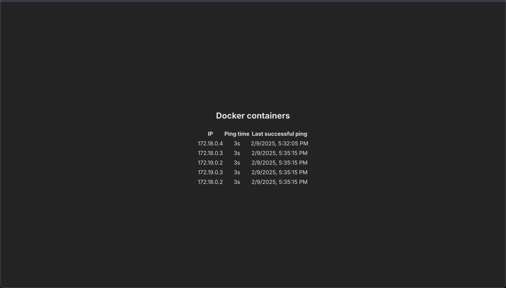

# Monito Frontend

Simple frontend for docker monitoring written with React + Vite

# Standalone launch
 1. Specify period of polling in seconds and API link to backend in .env file, see [example](.env.example).
 2. Build image: ```docker build -t monito-frontend-img```
 3. Run container: ```docker run --name frontend -d monito-frontend-img```

